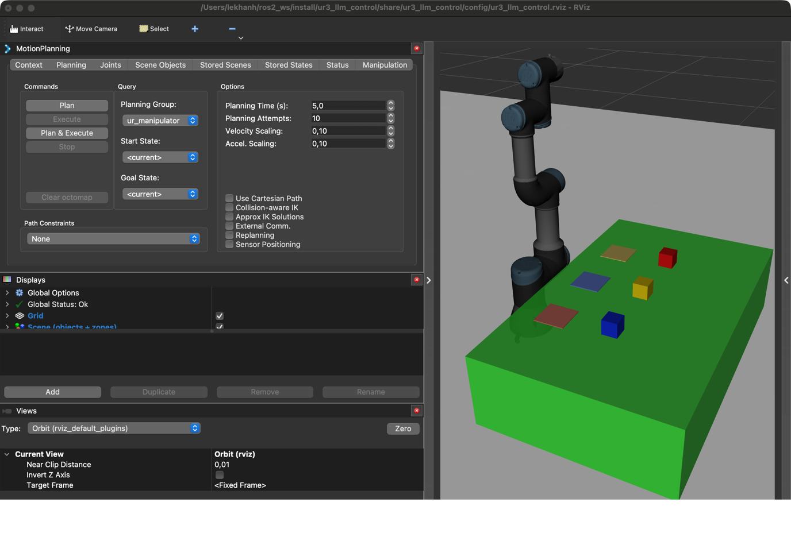

# ur3_llm_control

ROS 2 (Humble) package that controls a UR3 pick-and-place task with natural
language: an LLM (via [9Router](https://github.com/decolua/9router), run
locally) turns a command like *"Put the red cube in zone C."* into a
structured skill plan, validated then executed through MoveIt 2.

```
Natural Language Command -> LLM Planner -> JSON Plan -> Plan Validator
  -> Skill Executor -> MoveIt 2 -> UR3
```

## Personalization

`student_id = 20020675` → `75 mod 6 = 3` → **P = 3**: Zone A = Yellow, Zone
B = Blue, Zone C = Red.

## Structure

- `skill_server` (C++) — the only MoveIt-facing node. Services
  `/skill/home`, `/skill/pick`, `/skill/place`; returns `SUCCESS` /
  `FAILED` / `INVALID_OBJECT` / `INVALID_ZONE` / `PLANNING_FAILED`.
- `llm_planner.py` — calls the local LLM and parses its JSON plan.
- `task_validator.py` — rejects any skill/object/zone outside the whitelist.
- `skill_executor.py` — ROS 2 service-client wrapper around `skill_server`.
- `task_runner.py` — entry point; prints `USER COMMAND` / `LLM PLAN` /
  `EXECUTION` / `TASK SUCCESS`.
- `worlds/tabletop.sdf` — UR3 + table + `red_cube`/`yellow_cube`/`blue_cube`
  + zone markers, all at fixed poses in `config/scene.yaml`.

## Build

```bash
mkdir -p ~/ros2_ws/src && cd ~/ros2_ws/src
git clone <this-repo-url> ur3_llm_control
vcs import . < ../letter_writer/dependencies.repos
cd ~/ros2_ws && colcon build --symlink-install
```

## 9Router (local LLM gateway)

```bash
npm install -g 9router
9router --skip-update -n -l -H 127.0.0.1   # dashboard: http://127.0.0.1:20128
```

In the dashboard, enable **OpenCode Free** (no login needed), copy the API
key from `Endpoint & Key`, then:

```bash
export NINEROUTER_API_KEY=<your-key>
```

## Run

```bash
source ~/ros2_ws/install/setup.bash
ros2 launch ur3_llm_control llm_robot.launch.py ur_type:=ur3

# once Gazebo/MoveIt/skill_server are up (~20 s):
$(ros2 pkg prefix ur3_llm_control)/lib/ur3_llm_control/run_command.sh \
  "Put the red cube in zone C."
```

```
USER COMMAND:
Put the red cube in zone C.

LLM PLAN:
- pick(red_cube)
- place(red_cube, zone_c)
- home()

EXECUTION:
pick(red_cube) .............. SUCCESS
place(red_cube, zone_c) ..... SUCCESS
home() ...................... SUCCESS

TASK SUCCESS
```

Other phrasings work the same way (e.g. `"Hãy lấy khối màu vàng và đặt nó
vào ô A."`) — the LLM decides the skills, not string matching.

## Result

- Video demo: `<Google Drive link — public>`
- GitHub repo: https://github.com/Khanhkhan1/ur3_llm_control


